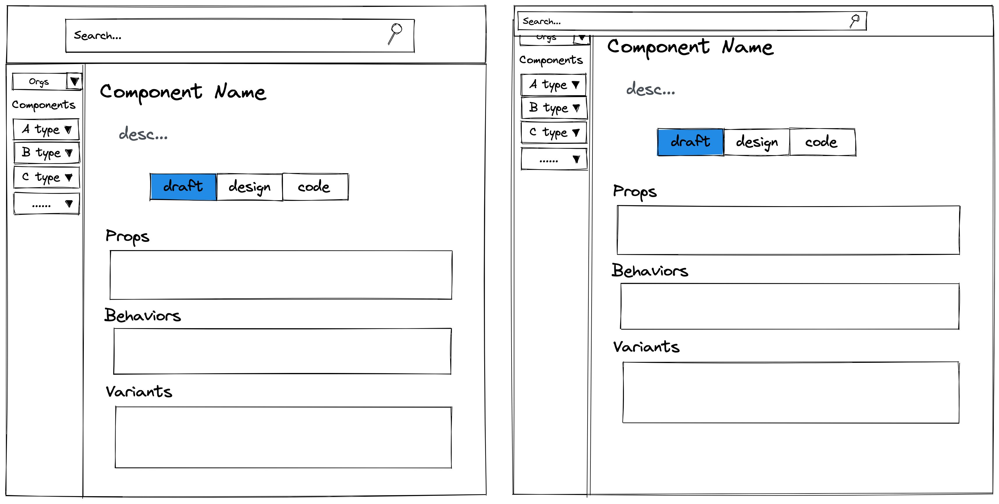

# Blueprint

## 背景

需要有一个平台用于产设研协作，描述组件整个生命周期，包括提案、设计、代码阶段，各个角色都可以通过这个平台来管理与发布组件，修改或查看组件的不同阶段与状态。

## 专业设计师画的效果图

## 文件夹架构师需要知道的事情

- `/fake/` 假的 Server
- `/src/components/` 界面结构组件
    - `_internal/` 我想用它存放一些通用组件，但最终都一团糟了
- `/src/trivial/` 一些琐碎又不想起名的东西
- `/src/types/` 用 ".d.ts" 限制这里全是 TS 类型
